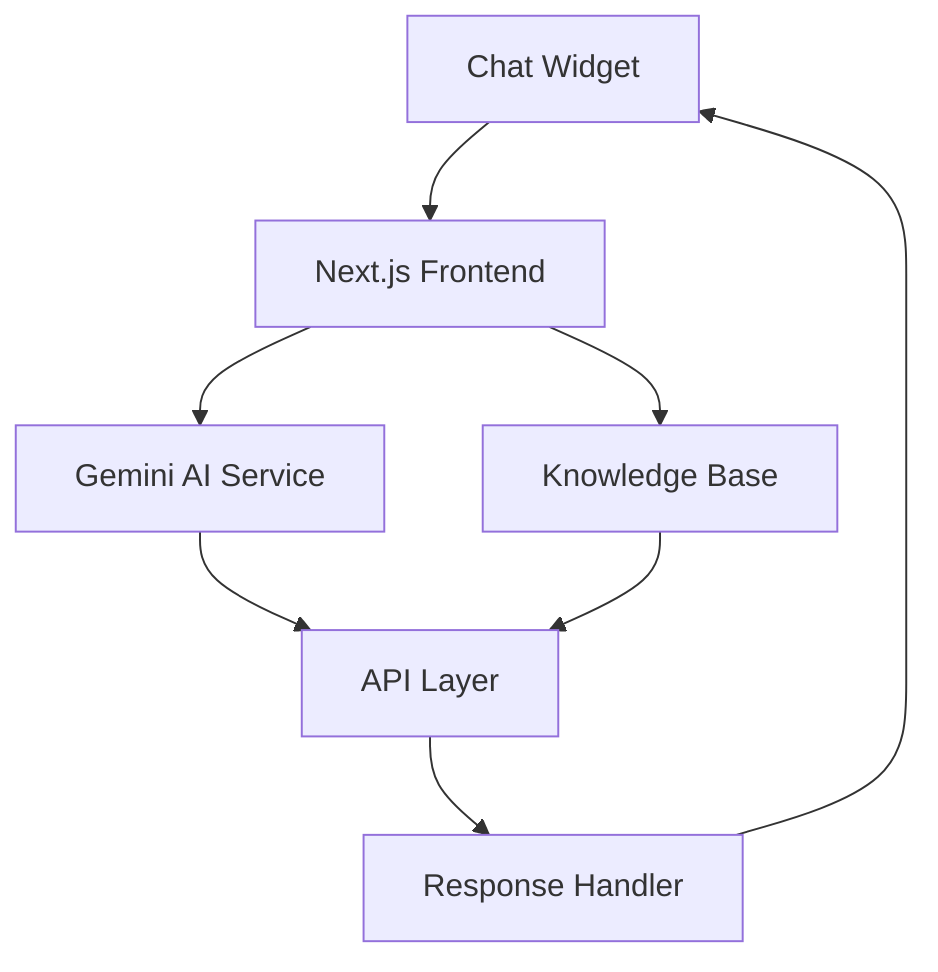
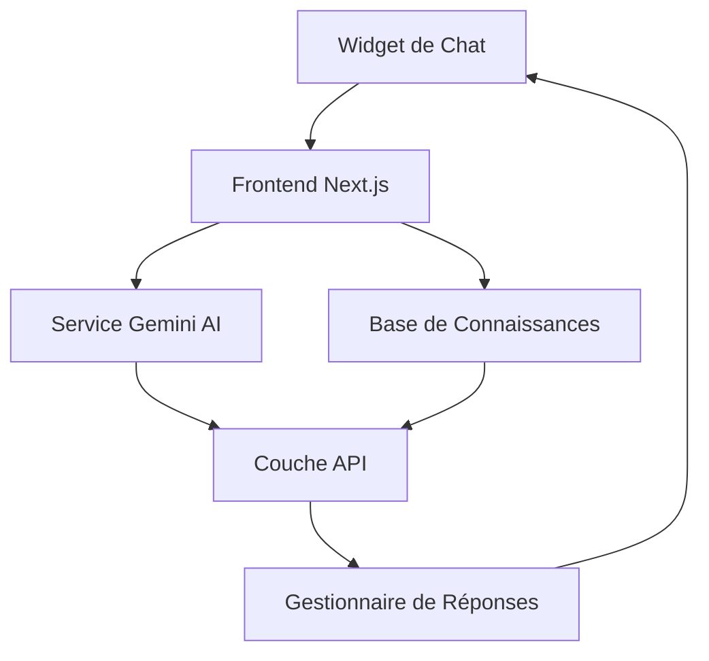

# Hakach Transfer Virtual Assistant Widget

## Overview
The Hakach Transfer Virtual Assistant is an intelligent chatbot widget designed to enhance the user experience on the Hakach Transfer platform. This modern, responsive widget provides instant support and information about money transfer services, helping users navigate through the platform effortlessly.

## Features
- 🤖 AI-Powered Responses: Leverages Google's Gemini AI for intelligent and context-aware conversations
- 💬 Real-time Chat Interface: Smooth, animated chat experience with typing indicators
- 🌐 Responsive Design: Adapts perfectly to all screen sizes (mobile, tablet, desktop)
- 🎯 Transfer-Specific Knowledge: Specialized in money transfer topics, fees, and services
- ⚡ Quick Responses: Instant answers for common queries
- 🔄 Smart Context Handling: Maintains conversation context for more relevant responses

## User Guide
1. **Accessing the Assistant**
   - Look for the chat button in the bottom-right corner of your screen
   - Click to open the chat window

2. **Using the Assistant**
   - Ask questions about Hakach Transfer services
   - Get information about fees and rates
   - Learn about supported countries
   - Inquire about transfer processes

3. **Features for Users**
   - Minimizable chat window
   - Smooth animations
   - Easy-to-read conversation history
   - Quick response times

## Architecture

---

# Assistant Virtuel Hakach Transfer

## Aperçu
L'Assistant Virtuel Hakach Transfer est un widget de chatbot intelligent conçu pour améliorer l'expérience utilisateur sur la plateforme Hakach Transfer. Ce widget moderne et réactif fournit un support instantané et des informations sur les services de transfert d'argent, aidant les utilisateurs à naviguer facilement sur la plateforme.

## Fonctionnalités
- 🤖 Réponses alimentées par l'IA : Utilise l'IA Gemini de Google pour des conversations intelligentes et contextuelles
- 💬 Interface de chat en temps réel : Expérience de chat fluide avec animations de frappe
- 🌐 Design responsive : S'adapte parfaitement à toutes les tailles d'écran (mobile, tablette, ordinateur)
- 🎯 Connaissances spécialisées : Expertise en matière de transferts d'argent, frais et services
- ⚡ Réponses rapides : Réponses instantanées aux questions courantes
- 🔄 Gestion intelligente du contexte : Maintient le contexte des conversations pour des réponses plus pertinentes

## Guide d'utilisation
1. **Accéder à l'assistant**
   - Repérez le bouton de chat dans le coin inférieur droit de votre écran
   - Cliquez pour ouvrir la fenêtre de chat

2. **Utiliser l'assistant**
   - Posez des questions sur les services Hakach Transfer
   - Obtenez des informations sur les frais et les taux
   - Renseignez-vous sur les pays pris en charge
   - Informez-vous sur les processus de transfert

3. **Fonctionnalités pour les utilisateurs**
   - Fenêtre de chat réductible
   - Animations fluides
   - Historique des conversations facile à lire
   - Temps de réponse rapides

## Architecture

